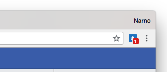

_F-Notifier_ is a browser extension that displays your [Facebook notifications](https://www.facebook.com/help/1036755649750898/) unread count.

[](https://chrome.google.com/webstore/detail/facebook-notifier/befpdcighpikpkklmfonkmdafmfnnkfn) [](https://addons.mozilla.org/fr/firefox/addon/f-notifier/) [](https://addons.opera.com/fr/extensions/details/f-notifier/) [](https://microsoftedge.microsoft.com/addons/detail/fnotifier/jkpbopolkbhegaabkoljoofcfingihlp)

## Preview



## Support

<https://github.com/ArnaudLigny/F-Notifier/issues>

## Development

### Source

<https://github.com/ArnaudLigny/F-Notifier.git>

### Install

```bash
npm install
```

### Test

[](https://github.com/ArnaudLigny/F-Notifier/actions/workflows/test.yml)

```bash
npm run test
```

### Build

```bash
npm run build
```

Actions:

1. process files (with [Gulp](https://gulpjs.com)), result is stored in `build/`
2. create a ZIP archive from `build/` in `dist/`

### Deploy to stores

[](https://github.com/ArnaudLigny/F-Notifier/actions/workflows/release.yml)

```bash
npm run release
```

## License

_F-Notifier_ is a free software distributed under the terms of the [MIT license](https://opensource.org/licenses/MIT).

© [Arnaud Ligny](https://arnaudligny.fr)
